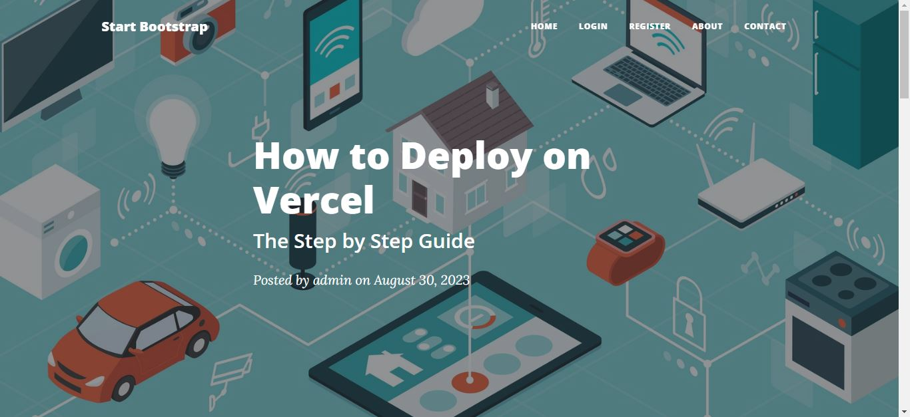

# Personal Blog Application

## Overview

Welcome to the Personal Blog Application! This web application allows users to create an account, log in, view blog posts, and leave comments. It's built using Python, Flask, Bootstrap, PostgreSQL, and deployed on Vercel.

## Features

<ul>
  <li>User Registration: Users can create an account to access the application.</li>
  <li>User Authentication: Secure authentication system using Flask-Login and hashed passwords.</li>
  <li>View Blog Posts: Users can browse through a list of blog posts.</li>
  <li>Comment System: Users can leave comments on blog posts.</li>
  <li>CRUD Operations: Admin users can create, edit, and delete blog posts.</li>
  <li>Responsive Design: Built using Bootstrap to ensure a consistent experience across devices.</li>
</ul>

## Usage

<ol>
  <li>Open your browser and navigate to <a href="https://blog-web-app-beta.vercel.app/"><code>https://blog-web-app-beta.vercel.app/</code></a>.</li>
  <li>Register a new user account.</li>
  <li>Log in using your newly created account.</li>
  <li>Explore the blog posts and leave comments.</li>
</ol>

## Technologies Used

<ul>
  <li>Python</li>
  <li>Flask</li>
  <li>SQLAlchemy</li>
  <li>Bootstrap</li>
  <li>PostgreSQL</li>
  <li>Vercel</li>
</ul>
